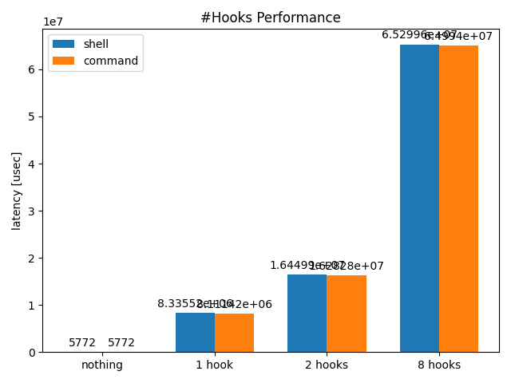
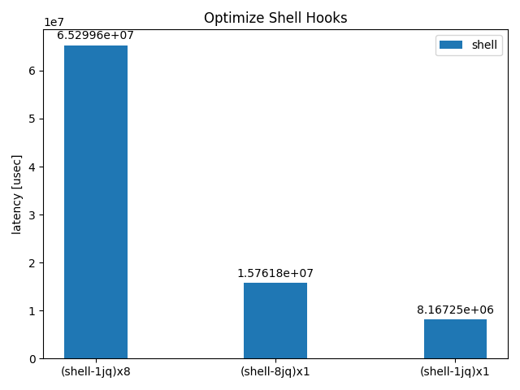
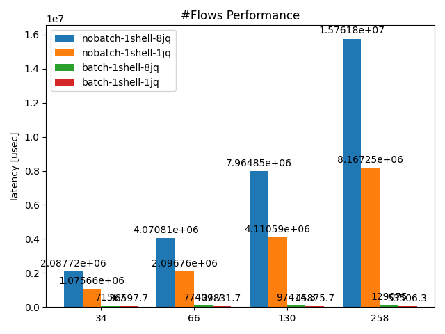

## Benchmarking

If we use linux-flow-exporter without fine-tuning, it may not perform well. For
example, if you use multiple hooks, each hooks do the memory-copy and
command-execution for each, which may slow down the performance. The following
figure shows a specific example of slow performance depending on the number of
hook chains.

There are two potential causes, one is caused by the hook type and the other is
caused by the hook execution. There are two hook types, shell and command, and
since command only executes and script generates tempolary shell-script file on
demand. Therefore, if file operations are the primary cause, it should be
improved by simply changing shell to command. As you can see from the figure,
these are not affected. It seems realistic to improve the performance by
improving the hook execution.

The number of hooks can be reduced by using a single command, although the
number of pipes remains the same, but the number of child command executions can
be reduced. We show how much performance can be improved by combining the above
tasks into a single hook. Furthermore, if we are using jq or other such queries
in a split format, aggregating the queries themselves may also improve the
performance by reducing the number of pipes. The following figure shows how much
performance can be improved by aggregating multiple hooks into single hook.

The goal of the linux-flow-exporter is to process 6M flows per second. This
number is set based on the session processing performance of commercial firewall
products, assuming that the number of flowlog discharge opportunities This
number is set based on the session processing performance of commercial firewall
products when assuming that the number of flowlog discharge opportunities is
about the same as the number of new sessions. (Note that session and flow are
different units.)

* Reference: Paloalto Firewall appliance spec
  * PA5280 new session: 3.5M session/sec
  * PA5280 max sessions: 100M session
  * PA-7080 new session: 6M session/sec
  * PA-7080 max sessions: 416M session
* [Reference: Hitachi Solutions Paloalto Catalog](https://www.hitachi-solutions.co.jp/paloalto/sp/download/thanks/pr01_6746.html)
* [Reference: Paloalto Spec Sheet](https://www.paloaltonetworks.com/resources/datasheets/product-summary-specsheet)

To improve this performance issue, change the frequency of hook execution that
it will be independent of the number of flow-data. The following figure shows
the performance difference as the number of flows increases. By introducing
batch hook mode, it is really improved. 98+% latency is eliminated.

